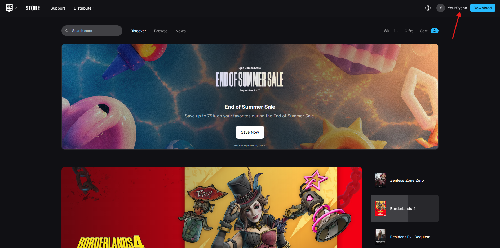
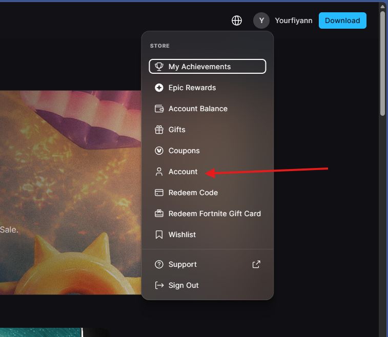
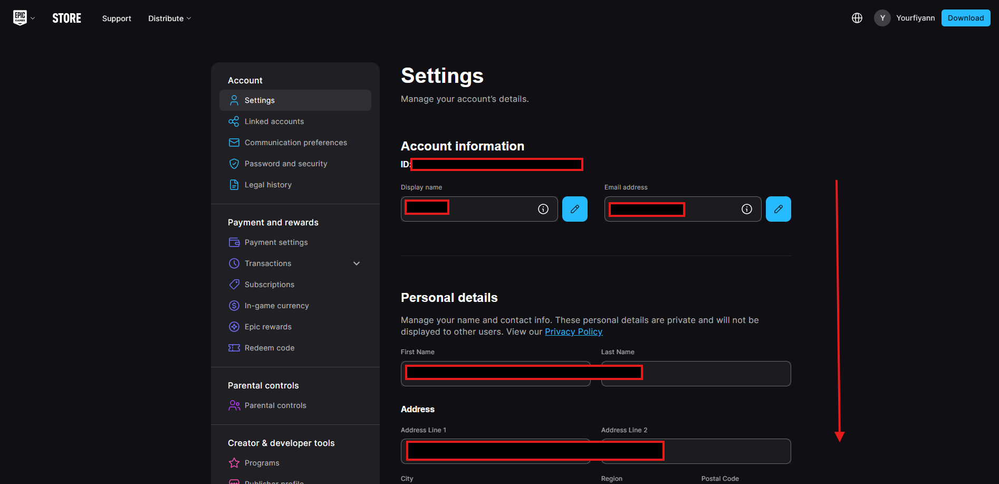
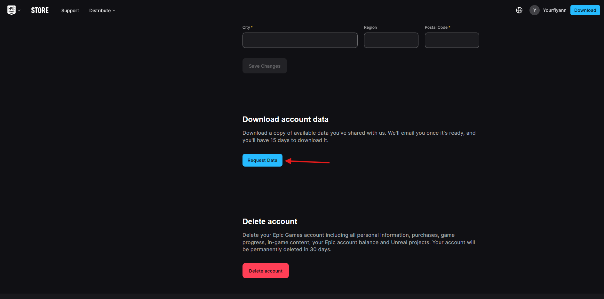
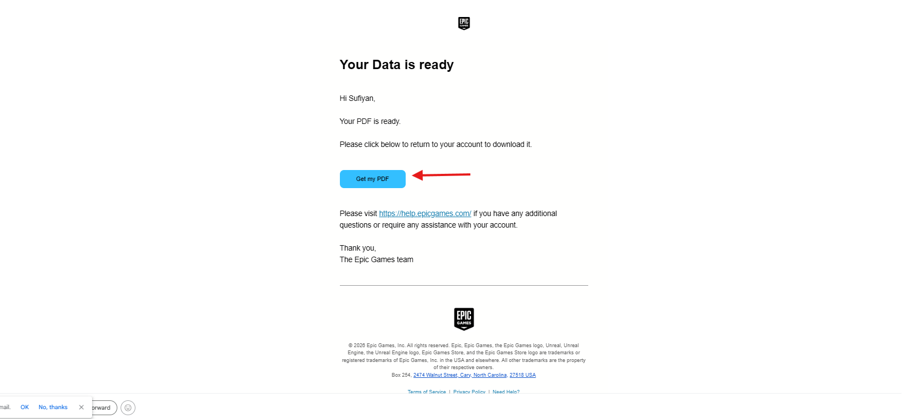
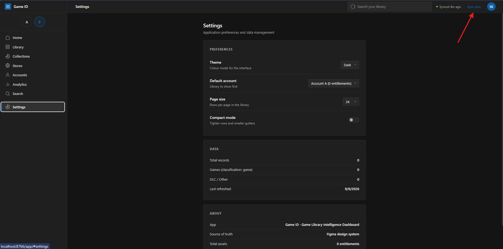
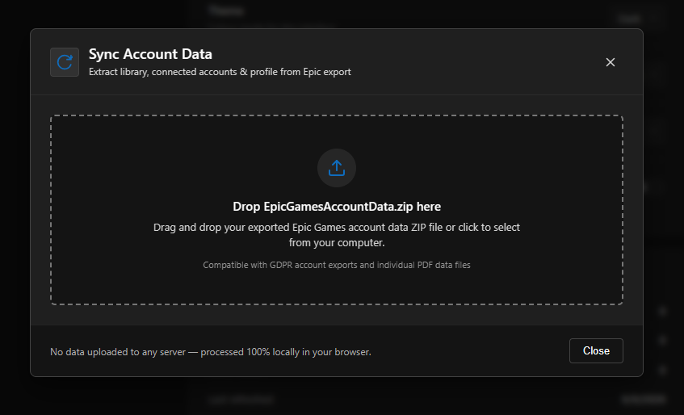
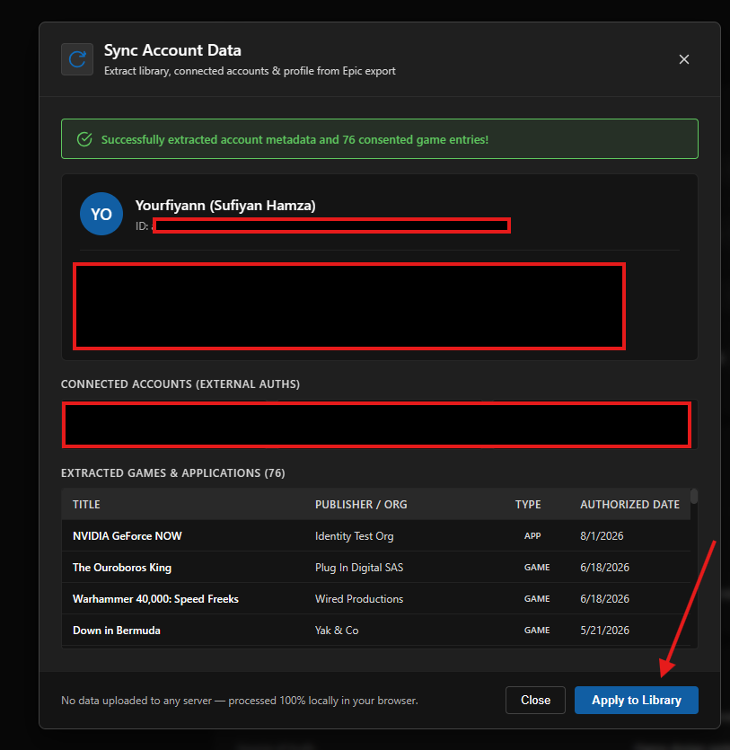

# Game ID 🎮 🆔

[](https://github.com/Yourfiyan/game-id)
[](https://github.com/Yourfiyan/game-id)
[](https://github.com/Yourfiyan/game-id)
[](https://github.com/Yourfiyan/game-id)

**Zero-server game ownership intelligence & library analytics.**  
Transform opaque store exports and transaction dumps into a rich, auditable, and beautiful personal gaming atlas.

---

## ⚡ The 10-Second Summary

**Game ID is not a launcher and not a storefront.** It is a read-only **intelligence dashboard and data extraction pipeline** designed for PC gamers who have accumulated hundreds of games across multiple accounts and storefronts.

Epic Games, Steam, and other launchers present your collection as a walled garden: unfilterable transaction ledgers, truncated game titles, zero cross-account portfolio analytics, and no insight into what you actually own versus what came with a free promotion.

Game ID ingests official account exports (`.zip` / `.pdf`) and transaction histories, corroborates titles across independent sources, enriches them with Steam and IGDB metadata, and serves a **zero-build, client-side dashboard** that runs directly in your browser.

```
                  ┌────────────────────────────────────────┐
                  │          Official Data Export          │
                  │   (Epic Account .zip / .pdf / dump)    │
                  └───────────────────┬────────────────────┘
                                      │
                 ┌────────────────────┴────────────────────┐
                 ▼                                         ▼
   ┌───────────────────────────┐             ┌───────────────────────────┐
   │  In-Browser Sync Engine   │             │   Python CLI Pipeline     │
   │  (PDF.js + JSZip Worker)  │             │   (tools/parse_*.py)      │
   │  100% Local / Zero Server │             │   Corroborate & Enrich    │
   └─────────────┬─────────────┘             └─────────────┬─────────────┘
                 │                                         │
                 └────────────────────┬────────────────────┘
                                      │
                                      ▼
                  ┌────────────────────────────────────────┐
                  │         Game ID Web Dashboard          │
                  │  (Fluent 2 UI · Analytics · Library)   │
                  └────────────────────────────────────────┘
```

---

## 💡 Why Game ID?

| The Problem | How Game ID Solves It |
|---|---|
| **Fragmented Multi-Account Ownership** | Independent account sandboxes (`Account A`, `Account B`) prevent double-counting shared titles while enabling cross-account analysis. |
| **Opaque Data & Broken Metadata** | Multi-source validation resolves clipped launcher names against receipts and enriches records with Steam/IGDB metadata. |
| **Privacy & Credential Risks** | **100% client-side execution.** Zero logins, zero OAuth scraping, zero telemetry, and zero remote server storage. |
| **Heavy Launcher Bloat** | Instant vanilla JavaScript architecture with zero build steps (`npm`, `webpack`, or `vite` not required). |

---

## 🛡️ The Two Ironclad Rules

Game ID operates on strict data integrity principles enforced in both the data pipeline and the frontend runtime:

1. **NO FABRICATION**: A field is populated **only if an authoritative source literally returned it**. Unverified attributes stay `null` (never backfilled with fake zeros, empty strings, or guesses). If a title string cannot be extracted, it is explicitly flagged as `"Needs Manual Verification"`.
2. **NO MERGING**: Each account is parsed, stored, and analyzed independently. If you own *Subnautica* on Account A and Account B, Game ID will never collapse them into a single fictional "library of 220 games" without accounting for duplicate acquisitions.

---

## 🚀 Quickstart: Running the Web App

Game ID requires **no compilation, no node_modules, and no backend services**.

```bash
# 1. Clone the repository
git clone https://github.com/Yourfiyan/game-id.git
cd game-id

# 2. Start any local static HTTP server
python -m http.server 8766

# 3. Open in your browser
# http://localhost:8766/app/
```

> **✨ Clean Privacy-First Launch:** A fresh installation starts with no accounts loaded. You can import your Epic Games library at any time using the 100% client-side **Sync now** button.

---

## 📸 Interactive Application Tour

The web application (`app/`) is crafted with Microsoft's **Fluent 2 Design System** in both Dark and Light themes.

| Page | Route | Features & Capabilities |
|---|---|---|
| **Home** | `#/` | Library highlights, portfolio breakdown, quick KPI counters, and recently acquired titles. |
| **Library** | `#/library` | Dynamic **Grid** and **List** views, multi-field filters (store, status, genre, tags), sort dimensions, and extraction confidence badges. |
| **Analytics** | `#/analytics` | Interactive charts: library valuation (MSRP vs amount paid), genre distribution, review distributions, and playtime reality. |
| **Accounts** | `#/accounts` | Account profile cards, linked authentications (Steam, PSN, Xbox, GitHub, Google), entitlement logs, and shared-title matrix. |
| **Stores** | `#/stores` | Storefront distribution metrics, marketplace platform support, and acquisition timeline graphs. |
| **Collections** | `#/collections` | Custom thematic groupings, developer franchises, and curated genre hubs. |
| **Search** | `#/search` (`Ctrl+K`) | Multi-attribute search across game titles, developers, publishers, tags, and transaction IDs. |
| **Settings** | `#/settings` | Real-time theme toggle (Dark/Light), active account selector, page size configuration, and sync controls. |

---

## 📥 How to Export & Sync Your Epic Games Account

Game ID includes an in-browser WebAssembly/JS engine that parses your official Epic Games GDPR account package with **zero server uploads**.

### Phase 1: Request & Download Your Epic Games Data

#### Step 1: Open Epic Games Store & Sign In
Go to [store.epicgames.com](https://store.epicgames.com), sign in, and click your profile avatar in the top-right corner.



#### Step 2: Open Account Settings
In the user dropdown menu, click **Account** to enter your account management portal.



#### Step 3: Scroll Down in Account Settings
On the **Settings** page, scroll down past personal information to the data section.



#### Step 4: Request Account Data
Under the **Download account data** section, click **Request Data**. Epic Games will generate your export package.



#### Step 5: Download the Data Package
Open the confirmation email from Epic Games titled **"Your Data is ready"** and download your file (`.pdf` or `EpicGamesAccountData.zip`).



---

### Phase 2: Import & Sync with Game ID

#### Step 6: Click "Sync now" in Game ID
In the Game ID header or Settings page, click **Sync now**.



#### Step 7: Drag and Drop Your Export File
Drag and drop your `EpicGamesAccountData.zip` or `.pdf` file into the modal dropzone.



> **🔒 Privacy Verification:** All processing is executed locally in your browser using `vendor/pdf.min.js` and `vendor/jszip.min.js`. Network inspection will confirm zero payload transmissions.

#### Step 8: Review Extracted Data & Apply
Inspect the parsed metadata (Display Name, Account ID, linked authentications, game grants) and click **Apply to Library**.



---

## 🛠️ Offline Python Data Pipeline (`tools/`)

For power users, batch workflows, and headless environments, the repository includes a Python CLI pipeline:

```
tools/
├── parse_transactions.py    # Parses raw transaction ledger dumps
├── parse_epic_export.py     # Parses official Epic .zip / .pdf packages
├── parse_receipts.py        # Parses email receipts (.eml) for MSRP & purchase prices
├── match_screenshots.py     # Resolves truncated launcher screenshot titles
├── build_catalog.py         # Deduplicates records and computes confidence scores
├── enrich.py                # Enriches records via Steam & IGDB APIs (cached in .cache/)
└── build_app_data.py        # Compiles final runtime JSON files (data/account*.json)
```

### Running the Python Pipeline

```bash
# 1. Parse raw transaction history dumps
python tools/parse_transactions.py --source data/source --out data/raw

# 2. Or parse an official Epic Games account export archive (.zip or .pdf)
python tools/parse_epic_export.py --input path/to/EpicGamesAccountData.zip --out data/raw/epic_export.json

# 3. Match and resolve launcher titles
python tools/match_screenshots.py --raw data/raw --account B --out data/raw/screenshot_resolution.json

# 4. Build per-account deduplicated catalogs
python tools/build_catalog.py --raw data/raw --out data/catalogs

# 5. Enrich records with Steam Store API metadata (cached locally)
python tools/enrich.py --catalogs data/catalogs --out data/enriched --cc IN --limit 0

# 6. Emit finalized runtime datasets
python tools/build_app_data.py
```

---

## 📊 Privacy Model & Benchmark Calibration

### 🔒 100% Private — Zero Personal Data on GitHub
The public repository contains **zero personal identifiable information (PII)**. All personal transaction logs, receipts, and account files in `data/` are strictly ignored by `.gitignore`.

When you clone the repository or open the web dashboard:
- **Instant Demo MVP Mode**: Game ID automatically loads a built-in, sanitized demo library (`Demo Account A` and `Demo Account B`) so anyone can immediately experience the full dashboard, interactive charts, and search.
- **Your Personal Data Stays Local**: When you import your official Epic Games data export (`.zip` / `.pdf`), all parsing and extraction occur **100% inside your browser** (via client-side WebAssembly workers). No credentials or files are ever sent to any remote server.

### 📐 Reference Calibration Dataset
The measurements below represent the real-world multi-account validation corpus used during development to calibrate the data pipeline, establish edge cases, and eliminate software bugs:

| Metric | Calibration Value | Architectural Significance |
|---|---|---|
| **Benchmark Records** | **226 entitlements** | Real-world multi-account ledger size used to verify schema performance. |
| **Account Split** | **Account A (51) · Account B (175)** | Proves multi-account sandbox isolation (6 overlapping titles never double-counted). |
| **Enriched Titles** | **132 of 226 (58.4%)** | Matched against Steam Store public metadata without guessing. |
| **Store-Exclusive Titles** | **94 of 226** | Validated fallback artwork and graceful missing-metadata handling. |
| **Title Collisions** | **218 distinct strings** | Proved that titles cannot be unique IDs (keying by deterministic ID is mandatory). |
| **Confidence Breakdown** | **63 High · 161 Medium · 2 Low** | Corroborated multi-source extraction certainty badges. |
| **Playtime Reality** | **4 of 226 non-zero** | Proved playtime must never be a default sort (98% of store grants are unplayed/unmeasured). |

---

## 📁 Repository Directory Structure

```
game-id/
├── app/                         # Frontend Web Application
│   ├── index.html               # Semantic shell & layout container
│   ├── app.js                   # Client-side router and state coordinator
│   ├── theme.css                # Fluent 2 design tokens (Light & Dark mode)
│   ├── index.css                # Global components, sidebar, and layout styling
│   ├── components/
│   │   └── sync-modal.js        # Client-side data sync and dropzone modal
│   ├── pages/                   # Modular page controllers and stylesheets
│   │   ├── home.js / .css       # Dashboard overview
│   │   ├── library.js / .css    # Filterable & searchable game grid/list
│   │   ├── analytics.js / .css  # Data visualizations and metrics
│   │   ├── accounts.js / .css   # Account profiles & external auths
│   │   ├── stores.js / .css     # Storefront breakdowns
│   │   ├── collections.js /.css # Thematic groupings
│   │   ├── search.js / .css     # Full-text search
│   │   └── settings.js / .css   # Theme, accounts, and preferences
│   ├── services/                # Core frontend business logic
│   │   ├── extractor.js         # Client-side PDF & ZIP extraction engine
│   │   ├── loader.js            # Runtime data loader and account manager
│   │   ├── analytics.js         # Statistical and financial computation engine
│   │   └── filters.js           # Multi-criteria filtering & sorting
│   └── vendor/                  # Bundled browser libraries (PDF.js, JSZip)
├── assets/
│   └── placeholders/            # Fallback cover art and background SVGs
├── data/                        # Local data directory (gitignored for privacy)
│   └── .gitkeep                 # Preserves directory structure
├── docs/
│   └── images/                  # Step-by-step export and sync visual guide
├── tools/                       # Python data engineering & enrichment scripts
├── DESIGN_SYSTEM.md             # Design system specifications & token reference
├── DATA_PIPELINE.md             # Detailed pipeline documentation & provenance rules
├── HANDOFF.md                   # Development history & architectural conventions
├── CHANGELOG.md                 # Chronological development log
├── p5-page-templates.html       # Design system page template specs
└── README.md                    # Primary documentation (this file)
```

---

## 🗺️ Project Roadmap & Capabilities

- [x] **Client-Side GDPR Sync Engine**: Drag-and-drop parsing of official Epic Games export ZIPs and PDFs.
- [x] **Zero-Dependency Web Dashboard**: Vanilla JS + CSS custom properties with Fluent 2 design tokens.
- [x] **Multi-Account Sandbox**: True isolation between independent gaming identities.
- [x] **Statistical Analytics Engine**: Valuation, genre distributions, and metadata confidence breakdowns.
- [x] **Sanitized Demo Catalog**: Instant out-of-the-box exploration without initial configuration.
- [ ] **Direct Steam Export Parser**: Ingestion of Steam purchase history and library exports *(Planned)*.
- [ ] **GOG Galaxy Export Support**: Ingestion of GOG library manifests *(Planned)*.
- [ ] **Client-Side IGDB API Integration**: Direct user-provided client credentials for on-the-fly cover art fetching *(Planned)*.
- [ ] **Custom Tag & Backlog Management**: LocalStorage tag editing and backlog status tagging *(Planned)*.

---

## 🤝 Contributing & Development

Game ID is built with minimalism and reproducibility in mind:

- **No framework dependencies**: Keep the frontend pure standard ES modules and modern CSS.
- **Data integrity**: Never write code that fabricates missing data or silently merges separate accounts.
- **Privacy guarantees**: The client-side extractor must remain 100% local with zero remote telemetry.

To contribute:
1. Fork the repository.
2. Create a feature branch (`git checkout -b feature/awesome-feature`).
3. Test your changes locally (`python -m http.server 8766`).
4. Commit your improvements and open a Pull Request.

---

## 📄 License

This project is licensed under the [MIT License](LICENSE) — free for personal, educational, and open-source use.
